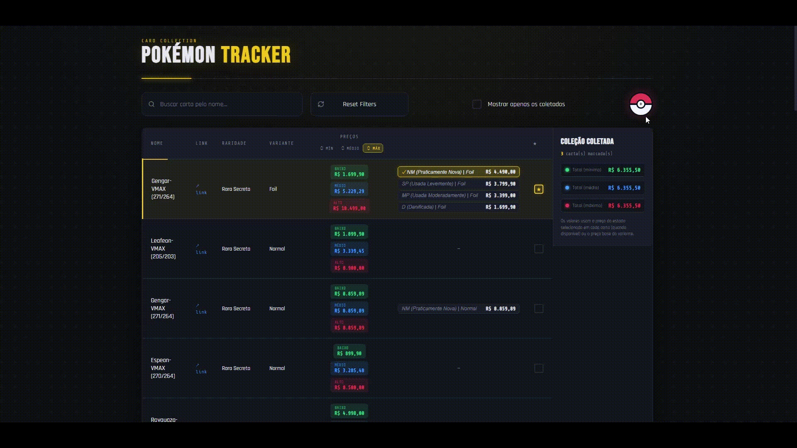

# Pokémon Card Collection Manager

Uma aplicação web para gerenciamento de coleções de cartas Pokémon, permitindo pesquisar cartas, acompanhar preços e favoritar variantes.

O projeto foi desenvolvido como uma forma de explorar tecnologias modernas do ecossistema Python, combinando backend, automação, banco de dados e uma interface web dinâmica.

---

## Funcionalidades

* Busca rápida de cartas
* Armazenamento local utilizando SQLite
* Consulta de preços para diferentes variantes
* Sistema de favoritos
* Interface inspirada em uma Pokédex
* Atualizações dinâmicas utilizando HTMX
* Automação para obtenção de dados com Playwright

---

## Tecnologias utilizadas

### Backend

* Python
* FastAPI

### Frontend

* HTMX
* HTML5
* CSS3
* JavaScript

### Banco de Dados

* SQLite

### Automação

* Playwright

---

## Estrutura do projeto

```
components/
├── main.py           # Aplicação FastAPI
├── database.py       # Banco de dados
├── scraper.py        # Coleta das informações
├── parser_novo.py     # Processamento dos dados
└── models.py          # Modelos da aplicação

templates/             # Páginas e partials Jinja2
static/                 # CSS, JS e imagens

experiments/            # Scripts manuais usados durante o desenvolvimento
                        # (scraping exploratório, não são testes automatizados)

requirements.txt        # Dependências Python
linux_installer.sh      # Instala e inicia a aplicação no Linux
iniciar_windows.bat     # Instala e inicia a aplicação no Windows
demo.gif                # Demonstração usada no README
LICENSE                 # Licença MIT
```

---

## Para facilitar instalação e execução de usuários que não são acostumados com a computação

### Para windows

Há um arquivo ```iniciar_windows.bat```, que instala as dependencias e inicia automaticamente a aplicação, só resta abrir no navegador em ```http://127.0.0.1:8000```
* Para a primeira execução é necessário iniciar esse arquivo como administrador, a fim de baixar o que é necessário para rodar o programa

### Para Linux

O arquivo ```linux_installer.sh```, instala as dependencias e inicia automaticamente a aplicação, só resta abrir no navegador em ```http://127.0.0.1:8000```


## Como executar

### Clone o repositório

```bash
git clone <URL_DO_REPOSITORIO>
cd cartas-pokemon
```

### Instale as dependências

```bash
pip install -r requirements.txt
```

### Execute a aplicação

```bash
cd components
uvicorn main:app --reload
```

Depois, abra o navegador em:

```
http://127.0.0.1:8000
```

---

## Objetivo do projeto

Este projeto foi desenvolvido principalmente para aprofundar conhecimentos em:

* Desenvolvimento Web com FastAPI
* Arquitetura de aplicações Python
* Banco de dados SQLite
* Web Scraping
* Automação de navegador
* HTMX para interfaces dinâmicas
* Organização e manutenção de projetos

---

## Próximas melhorias

* Autenticação de usuários
* Dashboard com estatísticas da coleção
* Histórico de preços
* Deploy em nuvem
* Testes automatizados
* Docker

---

## Demonstração

<p align="center">
  
</p>

---

## Licença

Este projeto está disponível sob a licença MIT.

---

## Autor

**Caio Groff**

Estudante de Ciência da Computação na USP.

Sempre aberto a feedbacks, sugestões e oportunidades de estágio na área de desenvolvimento de software.
